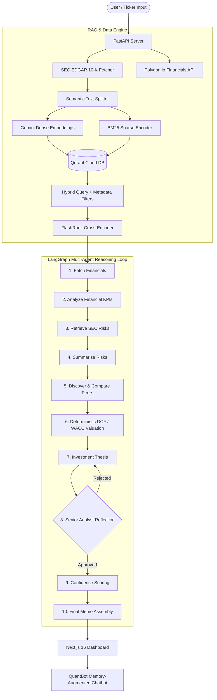

# 📈 Quant Agent — Production-Grade AI Financial Research & RAG System

[](https://python.org)
[](https://fastapi.tiangolo.com)
[](https://langchain-ai.github.io/langgraph/)
[](https://nextjs.org)
[](https://qdrant.tech)
[](https://groq.com)
[](https://logfire.pydantic.dev)

**Quant Agent** is an autonomous equity research assistant combining **LangGraph** multi-agent workflows, a production-grade **Hybrid RAG Pipeline** (Gemini Embeddings + Qdrant Cloud + FlashRank Re-ranking), deterministic **DCF & WACC Valuation engines**, and an interactive **Next.js 16 frontend** with a context-aware chatbot (**QuantBot**).

It ingests SEC EDGAR 10-K filings and financial market data to generate institutional-grade investment memos complete with confidence scoring and traceable source citations.

---

## 💡 System Architecture



---

## ✨ Key System Capabilities

- 🔍 **Hybrid RAG Pipeline**: Combines Google Gemini dense vector embeddings (`models/gemini-embedding-2`) and BM25 sparse vectors in Qdrant Cloud DB with strict payload metadata filtering (`ticker`, `year`) to eliminate cross-stock contamination.
- 🎯 **Neural Cross-Encoder Re-Ranking**: Integrates FlashRank (`ms-marco-TinyBERT-L-2-v2`) for second-pass context re-ranking, maximizing retrieval precision.
- 🧮 **Deterministic Valuation Engine**: Computes Gordon Growth DCF, WACC, and a $5 \times 5$ sensitivity matrix in pure Python without LLM arithmetic guessing.
- 🔄 **Self-Reflecting Senior Analyst Loop**: LangGraph reflection node reviews draft reports for financial contradictions and hallucinations, automatically cycling back for revisions.
- 💬 **Context-Aware QuantBot Chatbot**: Next.js floating chatbot with active report memory and suggested questions.
- 🔭 **Full Observability & Evals**: Pydantic Logfire tracing for latency/tokens and built-in Ragas evaluation suite (`Faithfulness` & `Response Relevancy`).

---

## 🛠️ Technology Stack

| Category | Technologies |
| :--- | :--- |
| **Backend API** | Python 3.11, FastAPI, Uvicorn, Pydantic |
| **Agent Orchestration** | LangGraph, LangChain, Groq SDK (`openai/gpt-oss-120b`) |
| **RAG & Search** | Qdrant Cloud DB, Gemini Embeddings, FastEmbed, FlashRank Cross-Encoder |
| **Data Sources** | SEC EDGAR 10-K (BeautifulSoup), Polygon.io API, `yfinance` |
| **Frontend** | Next.js 16 (App Router), React 19, TypeScript, Tailwind CSS v4 |
| **Observability & Evals** | Pydantic Logfire, Ragas Framework |

---


## ⚡ Quickstart

### 1. Environment Configuration
Create a `.env` file in the root folder:
```env
GROQ_API_KEY="your-groq-api-key"
GEMINI_KEY="your-gemini-api-key"
POLYGON_API_KEY="your-polygon-api-key"
QDRANT_API="your-qdrant-api-key"
QDRANT_CLUSTER="your-qdrant-cluster-url"
LOGFIRE_TOKEN="your-logfire-token" # Optional
```

### 2. Backend Setup (FastAPI)
```bash
python -m venv venv
# Linux/macOS: source venv/bin/activate | Windows: venv\Scripts\activate
pip install -r requirements.txt
python api.py
```
*Runs on `http://localhost:8000`*

### 3. Frontend Setup (Next.js)
```bash
cd web
npm install
npm run dev
```
*Runs on `http://localhost:3000`*

### 4. Run Ragas Evals
```bash
python -m core.evals.runner
```

---

## 👤 Author
Developed by **Mohit Aggarwal** as a demonstration of production-grade AI engineering, multi-agent systems, and financial RAG architectures.

